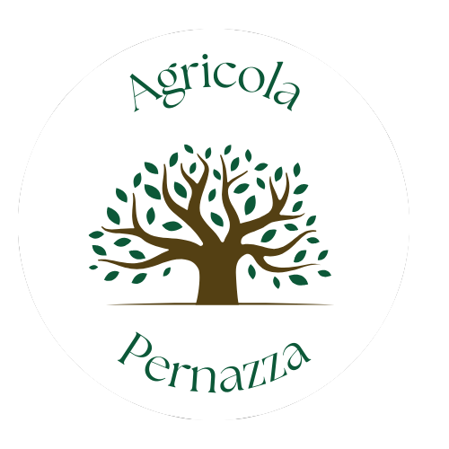
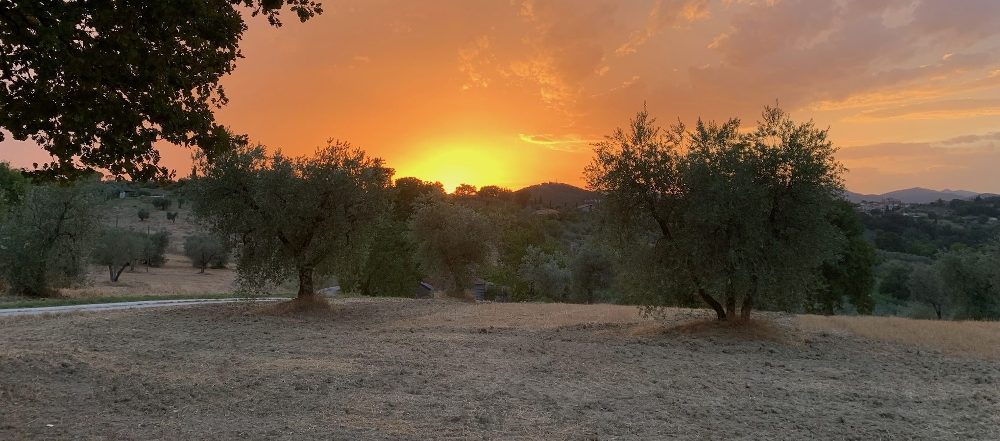

<div align="center">
  

  # Agricola Pernazza

  [](https://reactjs.org/)
  [](https://tailwindcss.com/)
  [](LICENSE)
  [](CONTRIBUTING.md)

  <p align="center">
    A modern e-commerce platform showcasing the finest agricultural products from the heart of Umbria, Italy 🌿
    <br />
    <a href="https://agricolapernazza.vercel.app/"><strong>Visit Website »</strong></a>
    <br />
    <br />
    <a href="#demo">View Demo</a>
    ·
    <a href="https://github.com/yourusername/agricolapernazza/issues">Report Bug</a>
    ·
    <a href="https://github.com/yourusername/agricolapernazza/issues">Request Feature</a>
  </p>
</div>

## ✨ Highlights

<div align="center">
  
</div>

### 🌟 Key Features

- **Product Catalog** - Beautifully showcased products with detailed information
- **Shopping Cart** - Seamless shopping experience with real-time updates
- **Responsive Design** - Perfect viewing on any device
- **Smooth Animations** - Enhanced user experience with Framer Motion
- **Italian Language** - Native language support
- **Secure Checkout** - Streamlined purchasing process

## 🚀 Quick Start

### Prerequisites

Before you begin, ensure you have the following installed:
- Node.js (v14 or higher)
- npm or yarn

### Installation

1️⃣ Clone the repository
```bash
git clone https://github.com/yourusername/agricolapernazza.git
cd agricolapernazza/webapp
 ```

2️⃣ Install dependencies

```bash
npm install
 ```

3️⃣ Start the development server

```bash
npm start
 ```

🎉 The application will be available at http://localhost:3000

## 🏗️ Project Structure
```plaintext
webapp/
├── 📁 public/
│   ├── 🖼️ images/
│   └── 🔤 fonts/
├── 📁 src/
│   ├── 🧩 components/
│   ├── 📄 pages/
│   ├── ⚛️ App.js
│   └── 🎯 index.js
 ```

## 🤝 Contributing
We love your input! We want to make contributing to Agricola Pernazza as easy and transparent as possible. Check out our Contributing Guidelines .

### Development Flow
1. Fork the repository
2. Create your feature branch ( git checkout -b feature/AmazingFeature )
3. Commit your changes ( git commit -m 'Add some AmazingFeature' )
4. Push to the branch ( git push origin feature/AmazingFeature )
5. Open a Pull Request
## 🗺️ Roadmap Feature Status Description User Authentication

🔄 Planned

Secure user accounts and profiles Payment Processing

🔄 Planned

Integration with payment gateways Product Reviews

🔄 Planned

Customer feedback and ratings CMS Integration

🔄 Planned

Easy product management Order Tracking

🔄 Planned

Real-time order status updates Inventory Management

🔄 Planned

Stock tracking and updates
## 📱 Screenshots
## 📄 License
This project is licensed under the MIT License - see the LICENSE file for details.

## 📞 Contact
## 🙏 Acknowledgments
- 💚 Special thanks to the Pernazza family for their dedication to quality agriculture
- 🌟 Thanks to all contributors who have helped shape this project
- 🌿 Inspired by the beautiful Umbrian countryside
Made with ❤️ in Umbria, Italy
